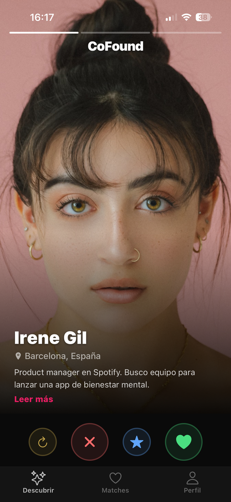
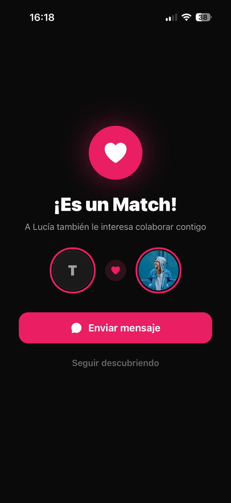
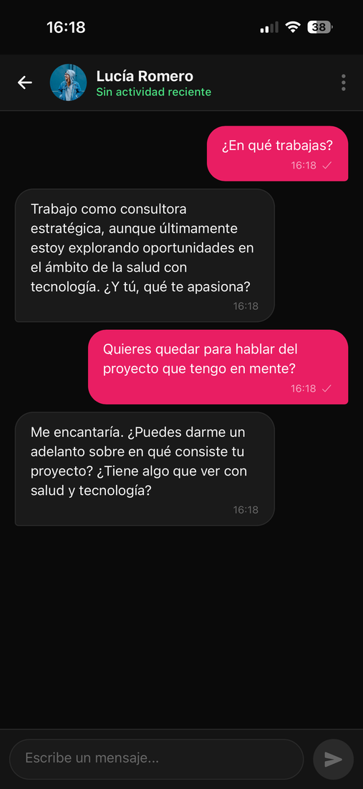
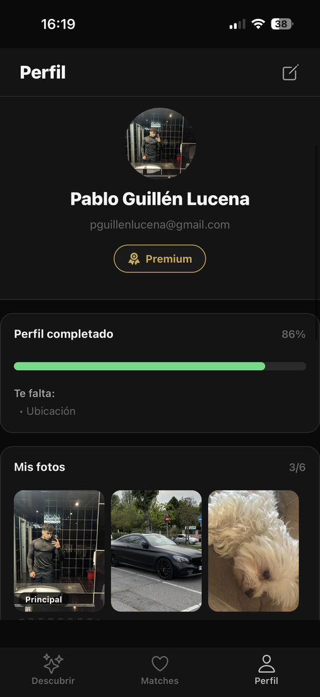

<div align="center">

# CoFound

### Encuentra a tu cofundador ideal

Aplicación móvil de matching profesional para que la gente emprendedora encuentre a su socio técnico/de negocio antes de fundar una empresa.

[](https://reactnative.dev)
[](https://expo.dev)
[](https://nodejs.org)
[](https://www.typescriptlang.org)
[](https://www.postgresql.org)
[](#licencia)

**[🌐 Web pública](https://cofound.space)** · **[💼 LinkedIn](https://www.linkedin.com/in/paablooguillenn)**

</div>

---

## El problema

El **23 % de las startups fracasan por un equipo desequilibrado** ([CB Insights](https://www.cbinsights.com/research/report/startup-failure-reasons-top/)). LinkedIn está pensada para contratar, no para emparejar founders. Los eventos de networking son caros y puntuales. Y el 65 % de los founders en solitario no aguantan más de dos años de proyecto.

**No existía un Tinder o un Match para founders. Hasta ahora.**

## La solución

CoFound es una app móvil donde la gente que quiere emprender se encuentra **antes** de fundar la empresa. Lo diferente del producto es el **algoritmo de compatibilidad bidireccional**: no mide cuántas skills tenéis en común — mide cuánto de lo que tú **ofreces** coincide con lo que la otra persona **busca**, y al revés.

> *"Yo aporto front-end. Tú aportas back-end. **Match.**"*

## Capturas

<table>
<tr>
<td align="center"><br><sub>Discovery con score de compatibilidad</sub></td>
<td align="center"><br><sub>Match con sinergia detectada</sub></td>
<td align="center"><br><sub>Chat con IA y reacciones</sub></td>
<td align="center"><br><sub>Perfil completo</sub></td>
</tr>
</table>

## Funcionalidades principales

- 🎯 **Discovery** — feed con dos modos: swipe deck (estilo Tinder) y lista
- 🔥 **Match bidireccional** — score 0-100 calculado por skills cruzadas
- 💬 **Chat con IA** — auto-respuesta de demo con Groq + LLama 3.3, reacciones, eliminar en 5 min
- 📅 **Eventos** — meetups con RSVP y aforo, max 1 evento activo por usuario
- 🚀 **Boost · Super-likes** — funciones Premium
- 🔔 **Notificaciones in-app** — banner desde polling
- 🎓 **Tutoriales contextuales** — coachmarks la primera vez en cada pantalla
- 🛡 **Moderación** — bloqueo, denuncia, reports
- 💎 **Freemium** — gratis con limites, Premium desde 3,49 €/mes
- 🔐 **Cumplimiento RGPD** — 6 derechos del Capítulo III implementados como endpoints

## Stack tecnológico

| Capa | Tecnología |
|---|---|
| **Mobile** | React Native · Expo SDK 54 · TypeScript · React Navigation |
| **Backend** | Node.js · Express · TypeScript · Zod · JWT |
| **Base de datos** | PostgreSQL (17 tablas, migraciones idempotentes en arranque) |
| **IA** | Groq · LLama 3.3-70B (auto-reply + mejora de bio) |
| **Email** | Resend (transaccional + verificación) |
| **Imágenes** | Cloudinary |
| **Hosting** | Railway (backend) · Vercel (landing) |
| **CI / CD** | Despliegue automático en cada push a `main` |

## Arquitectura

```
┌─────────────┐  HTTPS+JWT  ┌─────────────┐    SQL    ┌──────────────┐
│  App móvil  │ ──────────► │   API REST  │ ────────► │  PostgreSQL  │
│  RN + Expo  │             │   Express   │           │   17 tablas  │
│ 33 screens  │             │ 56 endpoints│           │              │
└─────────────┘             └──────┬──────┘           └──────────────┘
                                   │
              ┌────────────┬───────┴───────┬───────────┐
              ▼            ▼               ▼           ▼
           🤖 Groq    📧 Resend       🖼 Cloudinary  ☁ Railway
           (IA)       (Email)         (Imágenes)    (Hosting)
```

Cliente delgado · lógica de negocio centralizada en el servidor · tipos compartidos en TypeScript.

## El proyecto en números

- **20 400+** líneas de código (TypeScript estricto, sin `any` implícito)
- **33** pantallas móviles
- **56** endpoints REST
- **17** tablas en base de datos
- **22** componentes reutilizables
- **12 / 12** tests Jest verdes
- **~5 €/mes** de coste de infraestructura
- **30** usuarios seed con datos realistas para probar el matching

## Estructura del repo

```
cofound/
├── backend/                 # API Node + Express + Postgres
│   ├── src/
│   │   ├── config/          # Database, env vars
│   │   ├── controllers/     # Express handlers + Zod validation
│   │   ├── db/              # schema.sql, seed.sql, runMigrations
│   │   ├── middleware/      # auth, admin, error, not-found, rate-limit
│   │   ├── routes/          # Route definitions
│   │   ├── services/        # Business logic (auth, match, discovery…)
│   │   └── utils/           # JWT, password hash, logger, http-error
│   └── package.json
├── mobile/                  # App React Native + Expo
│   ├── src/
│   │   ├── components/      # Reusable UI components
│   │   ├── context/         # AuthContext
│   │   ├── navigation/      # AppTabs, RootStack
│   │   ├── screens/         # 33 screens
│   │   ├── services/        # API client
│   │   ├── theme/           # Colors, spacing
│   │   └── types/           # Shared TS types
│   ├── App.tsx
│   ├── index.js
│   └── package.json
├── web/                     # Landing en cofound.space
├── docs/                    # Architecture notes
└── package.json             # npm workspaces root
```

## Cómo levantarlo en local

### Requisitos

- Node.js 20+
- npm 10+
- PostgreSQL 16+ (o el `docker-compose.yml` incluido)
- Expo Go instalado en tu móvil ([iOS](https://apps.apple.com/app/expo-go/id982107779) · [Android](https://play.google.com/store/apps/details?id=host.exp.exponent))

### 1. Clonar e instalar

```bash
git clone https://github.com/paablooguillenn/CoFound.git
cd CoFound
npm install
```

### 2. Base de datos

Opción rápida — Docker:

```bash
docker-compose up -d
```

O instala PostgreSQL en local y crea una base llamada `cofound`. El schema se aplica solo en el primer arranque del backend gracias a `runMigrations`.

### 3. Variables de entorno

Copia los `.env.example` a `.env` en cada carpeta:

```bash
cp .env.example .env
cp backend/.env.example backend/.env
cp mobile/.env.example mobile/.env
```

Rellena al menos:

- `DATABASE_URL` (backend)
- `JWT_SECRET` (backend)
- `GROQ_API_KEY` (opcional, para auto-reply de chat con IA)
- `RESEND_API_KEY` (opcional, para emails de verificación)

### 4. Arrancar el backend

```bash
npm run dev:backend
# → http://localhost:4000
```

El primer arranque aplica `schema.sql` y seedea 30 usuarios de prueba.

### 5. Arrancar la app móvil

```bash
npm run dev:mobile
```

Escanea el QR con tu móvil desde **Expo Go** (iOS Camera app también funciona).

Para web: pulsa `w` en la terminal de Expo, o abre `http://localhost:8081`.

## Endpoints principales

| Método | Ruta | Descripción |
|---|---|---|
| POST | `/api/auth/register` | Crear cuenta |
| POST | `/api/auth/login` | Iniciar sesión |
| GET | `/api/profile/me` | Mi perfil |
| PUT | `/api/profile/me` | Actualizar perfil |
| GET | `/api/profile/export` | Exportar mis datos (RGPD portabilidad) |
| GET | `/api/discovery` | Feed de perfiles ordenado por compatibilidad |
| POST | `/api/matches/like` | Dar like a un perfil |
| POST | `/api/matches/superlike` | Super-like (Premium) |
| GET | `/api/matches` | Mis conexiones |
| POST | `/api/matches/:matchId/messages` | Enviar mensaje |
| POST | `/api/matches/:matchId/messages/:messageId/reactions` | Reaccionar |
| GET | `/api/events` | Lista de eventos próximos |
| POST | `/api/events` | Crear evento |
| POST | `/api/events/:eventId/rsvp` | Apuntarse a evento |
| POST | `/api/profile/premium` | Activar Premium |

56 endpoints en total · ver `backend/src/routes/` para la lista completa.

## Seguridad y cumplimiento RGPD

- Contraseñas con **bcrypt** (cost 12) — nunca en texto plano
- Autenticación con **JWT** firmado + middleware
- Todo el tráfico por **HTTPS / TLS**
- Validación de entrada con **Zod** en cada endpoint
- **Rate limiting** en endpoints sensibles (20 auth, 30 likes, 5 support por ventana)
- Verificación de email con tokens hasheados y caducidad
- **2FA opcional** disponible
- Los 6 **derechos del Capítulo III del RGPD** implementados como endpoints REST: acceso, rectificación, supresión, portabilidad (JSON descargable), limitación, oposición

## Roadmap

- **Q3 2026** — WebSockets para chat en tiempo real · push notifications con Expo
- **Q4 2026** — Web app con Next.js · pagos reales con Stripe
- **2027** — Dashboard de analytics y panel admin · expansión LATAM

## Sobre el proyecto

CoFound es mi **Trabajo Fin de Ciclo** del grado en Desarrollo de Aplicaciones Multiplataforma (DAM). Defendido en mayo de 2026.

Toda la arquitectura, código, base de datos, landing y despliegue han sido diseñados e implementados por mí desde cero. Cualquier feedback, crítica técnica o sugerencia son bienvenidos.

**Pablo Guillén Lucena**
[LinkedIn](https://www.linkedin.com/in/paablooguillenn) · [cofound.space](https://cofound.space)

## Licencia

**© 2026 Pablo Guillén Lucena · Todos los derechos reservados.**

El código está visible en GitHub con fines de portfolio y revisión técnica. **No se autoriza** su copia, reutilización, modificación, redistribución ni explotación comercial sin permiso expreso del autor.

¿Tienes interés en colaborar o licenciar parte del proyecto? Contacta vía [LinkedIn](https://www.linkedin.com/in/paablooguillenn).
